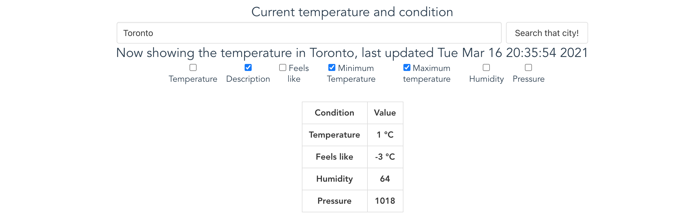
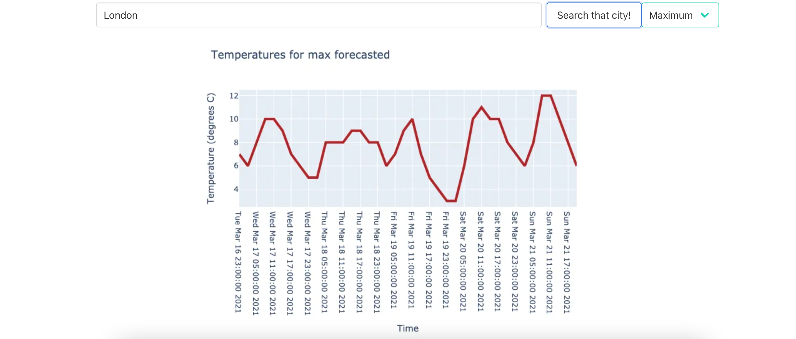

# Solution

- Connect to **a weather forecast API** to get your data!
  > We established a connection through our backend as this was a backend challenge and presented it in our frontend!

Here's how it looks like (a check means we intend not to see it)

- Create a **data visualization** (don't worry about making it pretty! A table, graph or any form of chart is fine!). Make sure users are able to **filter** through the data based on a parameter of your choice.
  > We create two data visualizations, one table which shows the current weather forecast and has checkboxes to filter the data. Our graph which shows a weather forecast has a dropdown menu to specifically choose what data you want.

Here's how it looks like!

# Challenges

- Figuring out a backend we could use and how we would go about dividing up the work according to our strengths

# Things we learned

## Adib

- Django requires a lot of setup so we ended up choosing FastAPI
- Learned how to create my own way to log requests to better debug
- Never ever mutate computed properties!
- If you get Docker problems such as error in TLS connections, do the following

`sudo docker-machine rm default`
`docker-machine create default --driver virtualbox`
`docker-machine env default`
`eval $(docker-machine env default) # to configure the shell`

# To do

- create a rest api
- make sure we can interact it through our frontend
- create the data visualizations, temperature and date of the week, day of the week, city
- make a time forecast of the air pollution (historical air pollution data)
- frontend will have a table to display city data
  -- headers include Day, average temp for the day, temp range, chance of precipitation
